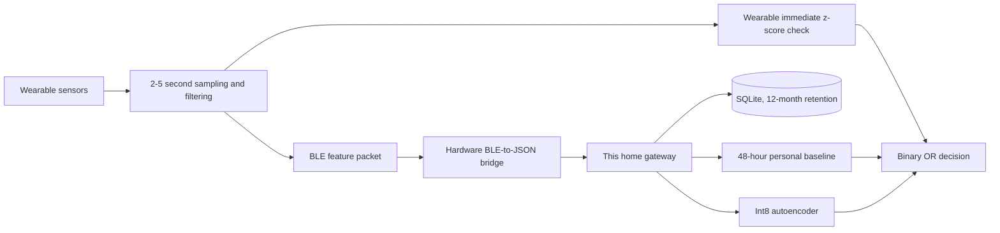

# Home Health Monitor

This repository implements the **home gateway** for a two-tier wearable anomaly
monitor. It is designed for a 512 MB Raspberry Pi Zero 2 W and returns one
binary result for every valid sensor packet:

```json
{"decision":"normal"}
```

or:

```json
{"decision":"anomaly"}
```

The result means that the measurements either match or depart from this
person's learned pattern. The model does not predict a named disease.

## How the complete system fits together



The physical wearable and its BLE firmware are outside this repository. The
gateway begins at the JSON packet boundary. It contains no SMS sender or other
outbound notification component.

The wearable measures three sensor modalities: optical PPG/SpO2, temperature,
and motion. It derives heart rate from the optical signal. The gateway packet
therefore contains four model values:

- derived heart rate;
- blood oxygen saturation (SpO2);
- body/skin temperature;
- motion intensity and a binary motion state.

Each value also has a quality score. The packet carries the wearable's own
immediate `normal` or `anomaly` result.

## What is implemented

- strict versioned packet validation;
- duplicate protection using device ID and sequence number;
- persistent SQLite packet, calibration, and prediction storage;
- automatic deletion of packet and event history older than 365 days;
- a 48-hour personal calibration using robust median/MAD statistics;
- the current V1 24-hour sequence path and the V2 eight-minute vector path;
- explicit quality and missing-data inputs with no forward filling;
- normal-only Conv1D V1 and short-vector V2 autoencoder trainers;
- fully integer-quantized TFLite model export and checksum validation;
- model persistence: two high-error windows, or one severe window;
- an always-available binary fallback when no model is installed;
- a dependency-light local HTTP JSON service;
- a hardened Raspberry Pi `systemd` unit;
- GalaxyPPG and supplied-synthetic-data audit tools;
- automated tests for the gateway, model contract, training input, and API.

Two trained models are versioned and installed on the Pi. V1 is the 18 KiB
complete vital-sign route. V2 is a 4.2 KiB real-PPG development candidate
trained on 22 people, with five-fold participant-grouped validation and
eight-minute aggregation. V2 has its own strict endpoint; it is not substituted
for V1 until Victory's exact wearable feature/BLE mapping and target-Pi
measurements are available. See the
[model comparison](docs/models/README.md).

Both actual training runs are executable notebooks:

- [V1 training](notebooks/train-and-evaluate-autoencoder.ipynb)
- [V2 real-PPG training](notebooks/train-real-ppg-vector-autoencoder.ipynb)

## Install on a Raspberry Pi

Use 64-bit Raspberry Pi OS Lite. On the Pi:

```sh
sudo git clone https://github.com/Sammybams/home-health-monitor.git \
  /opt/home-health-monitor
cd /opt/home-health-monitor
sudo ./deploy/install-pi.sh
```

The installer adds LiteRT and both included models, starts the service, verifies
both checksums and both prediction routes, then keeps it running across reboots.
See the short [Raspberry Pi guide](docs/raspberry-pi/README.md).

## Prediction order

The final rule is:

```text
anomaly = wearable anomaly
       OR gateway personal-baseline anomaly
       OR gateway autoencoder anomaly
       OR persistent sensor-quality failure
```

There is always a result. During the first 48 hours, before the personal
baseline is ready, the gateway still returns the wearable result and checks for
persistent sensor failures. If neither is abnormal, the result is `normal`.
When calibration completes, the personal comparison becomes active. The
installed V1 service also checks its 24-hour pattern. The V2 candidate instead
scores each short vector and combines roughly 16 scores every eight minutes.
If a model is absent or cannot load, the other checks continue.

## Run locally

Python 3.10 or newer is required. The fallback gateway has no third-party
runtime dependency:

```sh
PYTHONPATH=src python3 -m home_health_monitor \
  --host 127.0.0.1 \
  --port 8080 \
  --database data/gateway.db
```

In another terminal:

```sh
curl -sS http://127.0.0.1:8080/health

curl -sS -X POST http://127.0.0.1:8080/v2/packets \
  -H 'Content-Type: application/json' \
  --data-binary @examples/packet.json
```

The service looks for both model pairs by default:

```text
artifacts/gateway/model.tflite
artifacts/gateway/model-metadata.json
artifacts/real-ppg-v2/model.tflite
artifacts/real-ppg-v2/model-metadata.json
```

Install NumPy and a compatible LiteRT/TFLite interpreter to enable the model.
The service remains usable without them.

## Train off the Pi

Use Python 3.9-3.12 on a development computer:

```sh
python3 -m venv .venv-train
. .venv-train/bin/activate
python -m pip install --upgrade pip
python -m pip install -e '.[gateway-train,analysis,notebook]'

MPLBACKEND=Agg python -m jupyter nbconvert \
  --execute --to notebook --inplace \
  --ExecutePreprocessor.timeout=600 \
  notebooks/train-and-evaluate-autoencoder.ipynb
```

That notebook is the authoritative development run. For the later field model,
replace its development input with normal 24-hour windows created from the
actual target wearable. People are split between training, validation, and
testing; one person's windows never appear in more than one group. See the
[training guide](docs/training.md).

For the real-PPG candidate, place the downloaded ZIP outside Git and run:

```sh
export PULSE_TRANSIT_PPG_ZIP=/secure-data/pulse-transit-time-ppg.zip
MPLBACKEND=Agg python -m jupyter nbconvert \
  --execute --to notebook --inplace \
  --ExecutePreprocessor.timeout=900 \
  notebooks/train-real-ppg-vector-autoencoder.ipynb
```

## Test

```sh
PYTHONPATH=src python3 -m unittest discover -s tests -v
```

## Documentation

- [Model registry and V1/V2 comparison](docs/models/README.md)
- [API and packet contract](docs/api.md)
- [End-to-end model operation and Raspberry Pi use](docs/end-to-end.md)
- [Implemented architecture and decision logic](docs/design.md)
- [Training and artifact workflow](docs/training.md)
- [Dataset roles and audit commands](docs/data-sources.md)
- [Real Pulse Transit PPG data audit](docs/real-ppg-data.md)
- [Development dataset comparison, trained model, and plots](docs/development-model.md)
- [Short Raspberry Pi setup and use guide](docs/raspberry-pi/README.md)

Downloaded health datasets, generated vectors/windows, and SQLite databases
stay outside Git. Both small model artifacts, their reports, and plots are
versioned and clearly labelled for reproducibility.
