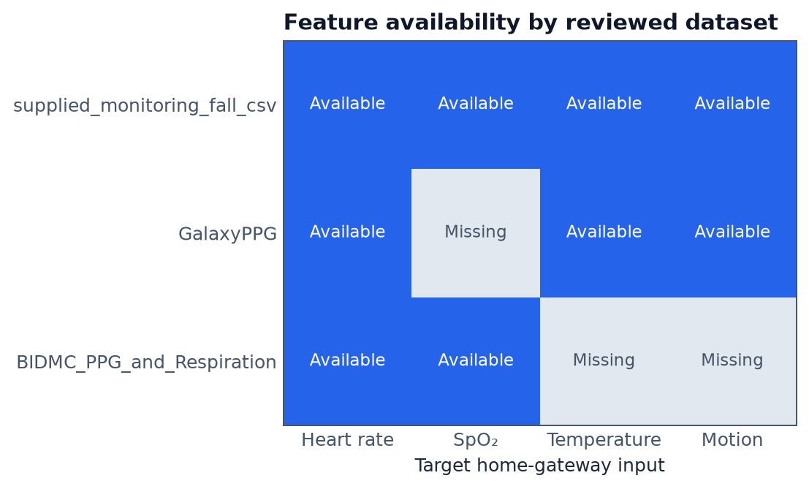
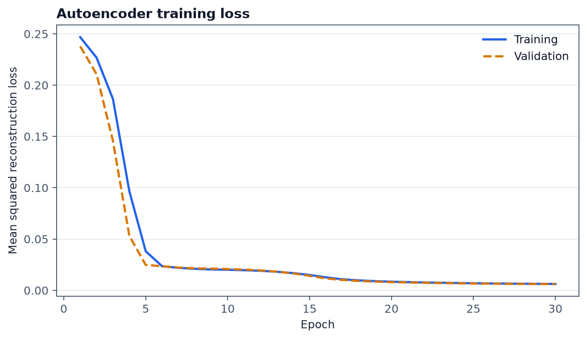
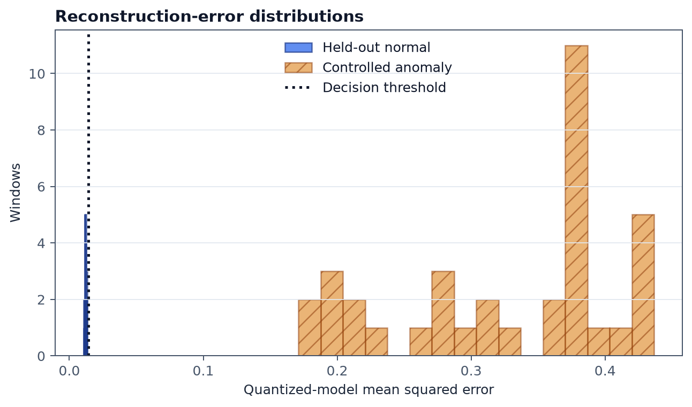
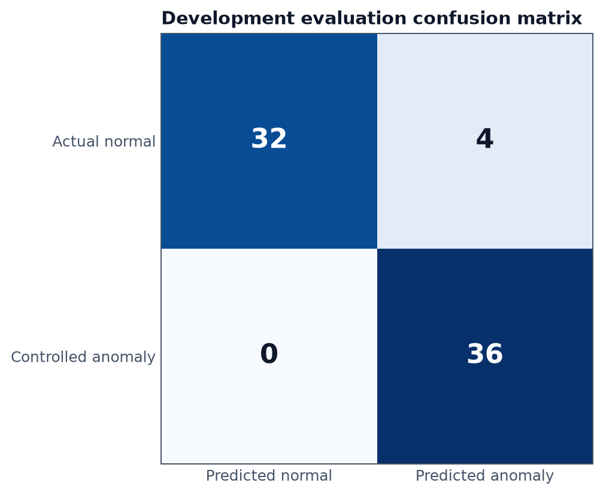
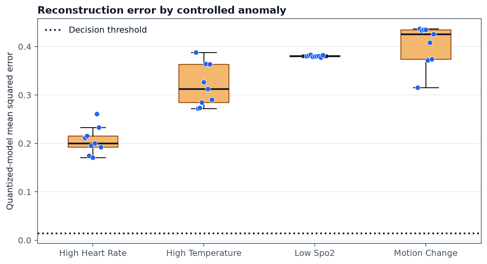
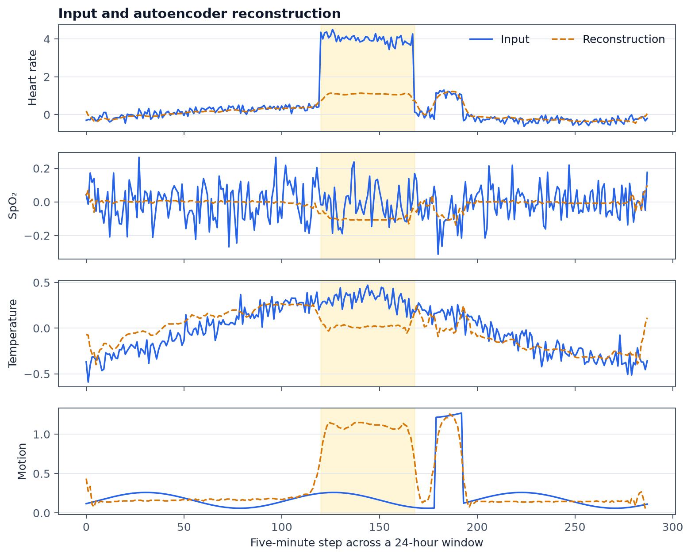

# Trained development autoencoder

There is now a real, runnable int8 model in
[`models/development-demo`](../models/development-demo). It proves the entire
training and inference mechanism and gives us visible results while recordings
from the final wearable are being collected.

The executed
[training and evaluation notebook](../notebooks/train-and-evaluate-autoencoder.ipynb)
is the source of this model, not a placeholder. Its training cell creates the
windows, fits for 30 epochs, quantizes, evaluates, and writes the artifacts.

## What data could safely be used



| Source | Directly observed evidence | Role used here |
|---|---|---|
| Supplied monitoring/fall CSV | 612 rows, but only 36 distinct rows; 11 distinct rows marked Normal; all four gateway features | Seeds the reproducible development-only normal-window generator |
| GalaxyPPG | 23 people with Galaxy Watch files; 69,491 valid HR rows, 2,203,200 motion rows, 1,253 skin-temperature rows; no SpO2 | Checks parsers, ranges, motion behaviour, and feature coverage |
| BIDMC | 53 ICU subjects; 25,489 HR and 25,365 SpO2 numeric observations; no temperature or motion; about eight minutes per subject | Checks real HR/SpO2 ranges and confirms the missing-feature limitation |

The sources cannot honestly be concatenated into one real cohort: their people,
devices, environments, times, and missing features do not line up. The safest
workable choice was therefore to train a development model on generated normal
24-hour patterns, informed by the supplied normal rows, and use GalaxyPPG and
BIDMC as separate engineering evidence.

## Exactly what was trained

The generator created 240 normal windows: 60 virtual subjects with four windows
each. A window contains 288 five-minute steps, representing 24 hours. Every
step has:

```text
heart rate derived by the wearable
SpO2
temperature
motion intensity
four sensor-quality values
eight matching present/missing masks
```

The split was by virtual subject: 42 subjects/168 windows for fitting, nine/36
for threshold selection, and nine/36 held out for the final normal check. Only
normal windows went into fitting. The anomaly examples were created afterwards
by applying sustained shifts to one feature for four hours. They test whether
the mechanism reacts; they are not training labels.

## What the plots show



Training and validation loss fell together from roughly `0.24` to `0.006` over
30 epochs. The similar curves show that the tiny model learned the generated
normal patterns without the training curve separating from validation.



The int8 model's persistent threshold is `0.01428919`. On this development
corpus, four of the 36 held-out normal windows crossed it, while all 36
controlled shift windows crossed it. The controlled changes are deliberately
clear, so this result demonstrates pipeline behaviour, not expected field
accuracy.



At the fixed threshold, the held-out development evaluation produced 32 true
normal results, four false anomalies, zero missed controlled anomalies, and 36
detected controlled anomalies. Accuracy was `94.44%`, anomaly precision `90%`,
recall `100%`, specificity `88.89%`, and F1 `94.74%`.



Each scenario contains nine windows, and all nine crossed the threshold. Low
SpO2 produced a tightly grouped score near `0.381`; motion change produced the
largest mean score (`0.406`); high temperature averaged `0.323`; and high heart
rate averaged `0.194`.



The blue line is what entered the model and the dashed orange line is what the
autoencoder rebuilt. In the shaded interval, heart rate was moved far outside
the learned normal pattern. The autoencoder continues producing a normal-like
shape, leaving a large reconstruction gap. That gap becomes the anomaly score.

## What a prediction means on the gateway

For every valid packet, the gateway returns either `normal` or `anomaly`.
During the first 48 hours, the answer uses the wearable's immediate result and
sensor-quality checks. After personal calibration, the gateway also applies
the person's robust z-score check. Once a model is loaded, it adds the 24-hour
autoencoder score.

The final rule is an OR: any active tier can make the answer `anomaly`. Heart
rate is not another physical sensor; it is derived from PPG before the packet
reaches this repository. The quality channels and masks help the model
distinguish physiological change from missing or unreliable measurements.

## Reproduce the development model

The notebook is the primary training entry point:

Create the training environment on a development computer, not the Pi:

```sh
python3.12 -m venv .venv-train
. .venv-train/bin/activate
python -m pip install -e '.[gateway-train,analysis,notebook]'
MPLBACKEND=Agg python -m jupyter nbconvert \
  --execute --to notebook --inplace \
  --ExecutePreprocessor.timeout=600 \
  notebooks/train-and-evaluate-autoencoder.ipynb
```

The notebook calls the following Python entry points internally. They remain
available for automation outside Jupyter:

```sh
home-health-gateway-train \
  /secure-work/development-normal-windows.jsonl \
  models/development-demo \
  --epochs 30 --batch-size 16 --seed 42 \
  --artifact-role development_demo
```

Profile the reviewed sources, then render the plots:

```sh
home-health-data-evidence \
  --supplied-csv /path/to/00000025-healthmonitoringandfalldetection.csv \
  --galaxy-root /path/to/GalaxyPPG/Dataset \
  --bidmc-zip /path/to/bidmc.zip \
  --output models/development-demo/data-evidence.json

MPLBACKEND=Agg home-health-development-report \
  models/development-demo/data-evidence.json \
  models/development-demo/training-report.json \
  docs/assets/development-demo
```

## Use it for gateway integration now

Run the gateway with the included model paths:

```sh
PYTHONPATH=src python3 -m home_health_monitor \
  --model models/development-demo/model.tflite \
  --model-metadata models/development-demo/model-metadata.json
```

For a Pi integration demonstration, copy those two files using the process in
the [Pi deployment guide](pi-deployment.md). Keep `artifact_role:
development_demo` visible in reviews. Replace both files together after the
same wearable has supplied representative normal recordings and the candidate
passes the field and Pi release checks in the [training guide](training.md).
