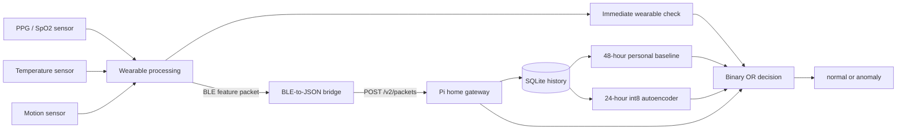

# Home gateway: end-to-end operation and Pi use

This is the canonical guide to what the model receives, how it was trained,
what happens for every wearable packet, and how the home gateway runs on a
Raspberry Pi Zero 2 W. This repository contains the home-gateway side only. It
does not contain wearable firmware, a BLE driver, or SMS functionality.

## Complete system boundary



The wearable wakes for approximately 2–5 seconds, reads its three sensor
modalities, filters them, derives heart rate from PPG, creates a compact feature
packet, sends it over BLE, and returns to sleep. A hardware-specific bridge
turns that BLE payload into the documented local JSON request. This repository
starts at that JSON boundary.

## What enters the gateway

The four physiological model values are:

1. `heart_rate_bpm`, derived from PPG on the wearable;
2. `spo2_percent`;
3. `temperature_c`;
4. `motion_intensity`, accompanied by a binary motion state.

The packet also includes device and sensor-configuration identity, timestamp,
sequence number, one quality value for each signal family, and the wearable's
immediate `normal` or `anomaly` result. The full payload is defined in the
[API contract](api.md).

## What happens for every packet

1. The gateway validates the entire packet and rejects unknown or invalid
   fields.
2. SQLite stores it once using `(device_id, sequence)` for duplicate protection.
3. Records older than 30 days are pruned.
4. The gateway checks persistent sensor-quality failures.
5. It loads or advances the person's 48-hour calibration.
6. When calibration is ready, it compares the current measurements with that
   person's median/MAD baseline.
7. When a model is installed, it constructs a 24-hour window and performs int8
   autoencoder inference.
8. It combines every available result, stores the event, and returns one binary
   prediction.

There is always a prediction. Before calibration or without a model, the
wearable result and quality path still return `normal` or `anomaly`.

## Personal calibration

Calibration requires all three conditions:

- at least 48 elapsed hours;
- at least 80% valid one-minute coverage;
- at least eight low-motion hours.

Only wearable-normal packets with quality values of at least `0.8` contribute.
The gateway stores the median and scaled median absolute deviation for each
person. A current value is converted into a robust personal deviation:

```text
(current value - personal median) / personal MAD scale
```

An absolute deviation of `4.0` or more activates the gateway baseline tier.

## The 24-hour model input

The gateway groups stored packets into 288 UTC-aligned five-minute bins. Each
bin contains eight values:

```text
4 personal-normalized physiological values
4 sensor-quality values
```

Eight matching present/missing masks are appended. The model tensor is
therefore `1 × 288 × 16`. Missing measurements are not copied forward.

## How the autoencoder makes a decision

The model was fitted using normal windows only. Its encoder compresses the
24-hour sequence through small temporal convolutions; its decoder attempts to
reconstruct the eight value channels. A familiar pattern reconstructs with a
small error. A sustained unfamiliar pattern leaves a larger gap between input
and reconstruction.

The included model uses:

```text
288×16 input
→ Conv1D(12)
→ strided Conv1D(8)
→ strided Conv1D(4)
→ upsampling decoder
→ 8 reconstructed values plus masks
```

The validation-set 99th percentile sets the persistent threshold. One score at
or above the severe threshold is immediate; otherwise two high scores within
the persistence interval are required.

The final rule is:

```text
anomaly = wearable anomaly
       OR personal-baseline anomaly
       OR autoencoder anomaly
       OR persistent quality failure
```

## Authoritative training notebook

[`notebooks/train-and-evaluate-autoencoder.ipynb`](../notebooks/train-and-evaluate-autoencoder.ipynb)
is the source of the committed development training run. It actually performs
all of these operations:

1. reads the committed copy of the supplied monitoring CSV;
2. verifies 612 rows, 36 distinct rows, and 11 distinct normal rows;
3. generates 60 deterministic development subjects and 240 normal windows;
4. splits by subject into 168 train, 36 validation, and 36 test windows;
5. trains the real Conv1D autoencoder for 30 epochs;
6. converts it to a fully int8 TFLite model;
7. calculates thresholds from int8 validation inference;
8. evaluates held-out normals and controlled anomalies;
9. writes the model, metadata, reports, and six plots.

The notebook calls the reusable implementation in
[`gateway/training.py`](../src/home_health_monitor/gateway/training.py). This
keeps notebook execution and command-line training on exactly the same code
path.

Run it on a development computer:

```sh
python3.12 -m venv .venv-train
. .venv-train/bin/activate
python -m pip install -e '.[gateway-train,analysis,notebook]'
MPLBACKEND=Agg python -m jupyter nbconvert \
  --execute --to notebook --inplace \
  --ExecutePreprocessor.timeout=600 \
  notebooks/train-and-evaluate-autoencoder.ipynb
```

Training is not performed on the 512 MB Pi. The Pi only loads the exported
18 KiB model and runs inference.

## Current development performance

The fixed-threshold evaluation contains 36 held-out generated normal windows
and 36 controlled anomaly windows:

| Metric | Result |
|---|---:|
| True normal | 32 |
| False anomaly | 4 |
| Missed controlled anomaly | 0 |
| Detected controlled anomaly | 36 |
| Accuracy | 94.44% |
| Precision | 90% |
| Recall/sensitivity | 100% |
| Specificity | 88.89% |
| F1 | 94.74% |

All four controlled scenarios—high heart rate, low SpO2, high temperature, and
motion change—were detected in nine of nine windows. These are clear sustained
shifts applied after training, so the numbers verify model and threshold
behaviour rather than field-population accuracy. The full evidence is in the
[model performance report](development-model.md) and
[`performance-summary.json`](../models/development-demo/performance-summary.json).

## Install the development model on the Pi

Follow the operating-system, account, virtual-environment, and `systemd` setup
in the [Pi deployment guide](pi-deployment.md). To use the included model for
integration testing, install it into the service's expected artifact directory:

```sh
sudo install -d -o root -g home-health -m 0750 \
  /opt/home-health-monitor/artifacts/gateway
sudo install -o root -g home-health -m 0640 \
  /opt/home-health-monitor/models/development-demo/model.tflite \
  /opt/home-health-monitor/artifacts/gateway/model.tflite
sudo install -o root -g home-health -m 0640 \
  /opt/home-health-monitor/models/development-demo/model-metadata.json \
  /opt/home-health-monitor/artifacts/gateway/model-metadata.json
sudo systemctl restart home-health-monitor
curl -sS http://127.0.0.1:8080/health
```

Require `model_loaded: true`. Then send the example packet and confirm the API
returns a binary decision. Reboot once to confirm SQLite and the service resume
without an interactive login.

## Moving from development to field use

Keep the architecture and notebook, but replace the development input with
reviewed normal recordings from the exact wearable, sensor placement, firmware,
temperature type, and feature calculations. Include the target population and
ordinary daily activities. Retrain, review false anomalies per person/day,
inspect subgroup and missing-data behaviour, then measure peak memory and
latency on the exact Pi image. Install the selected model and metadata together;
the gateway checksum prevents mismatched files from loading.
