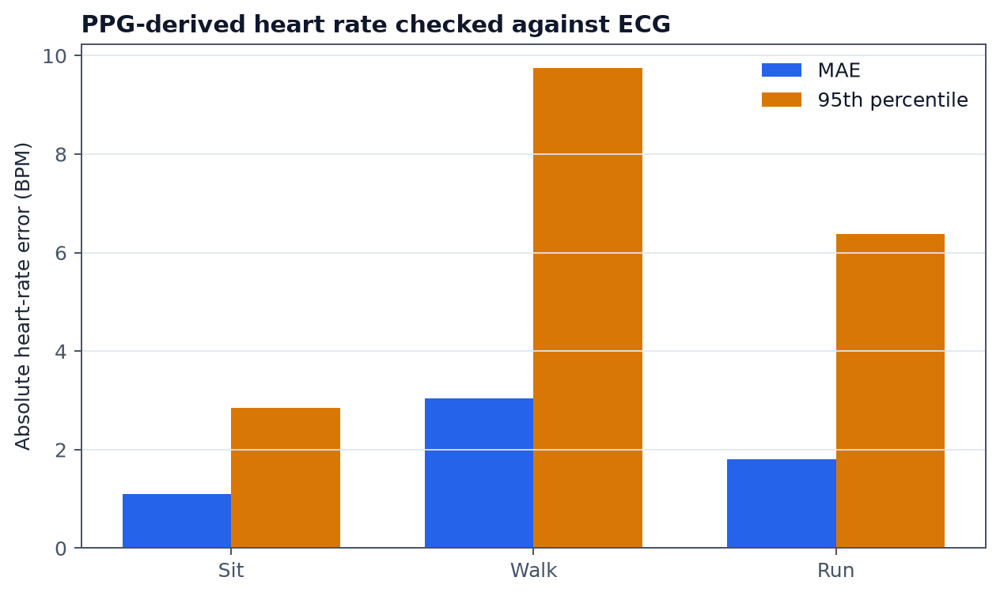
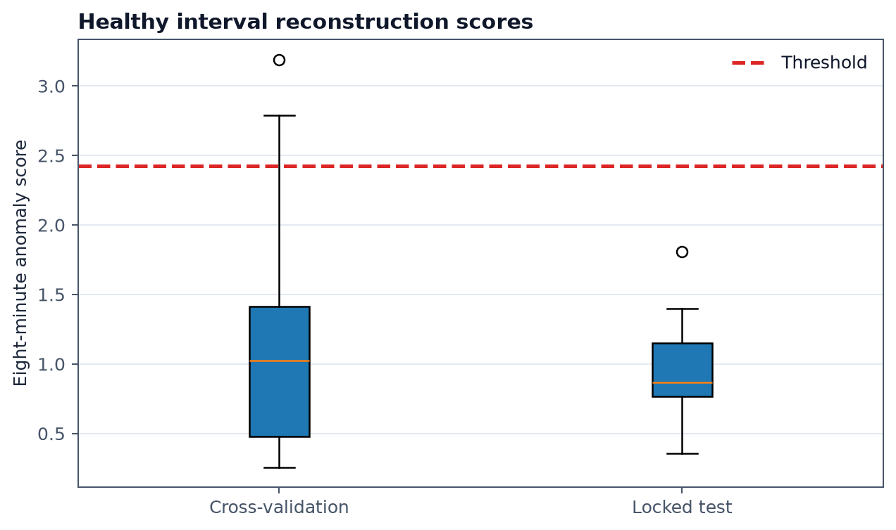
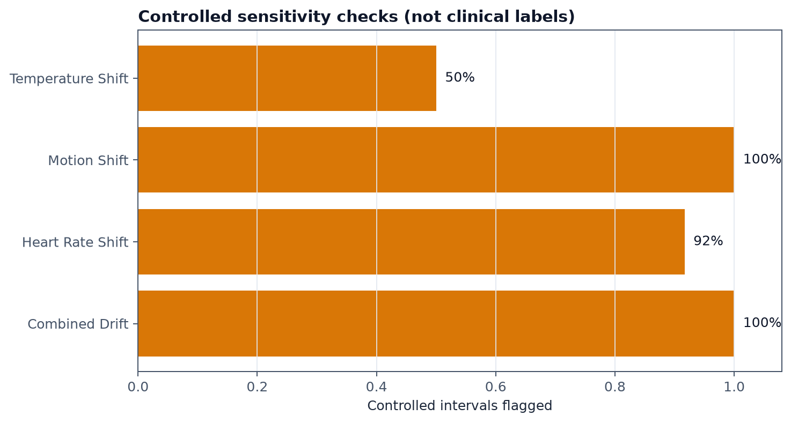
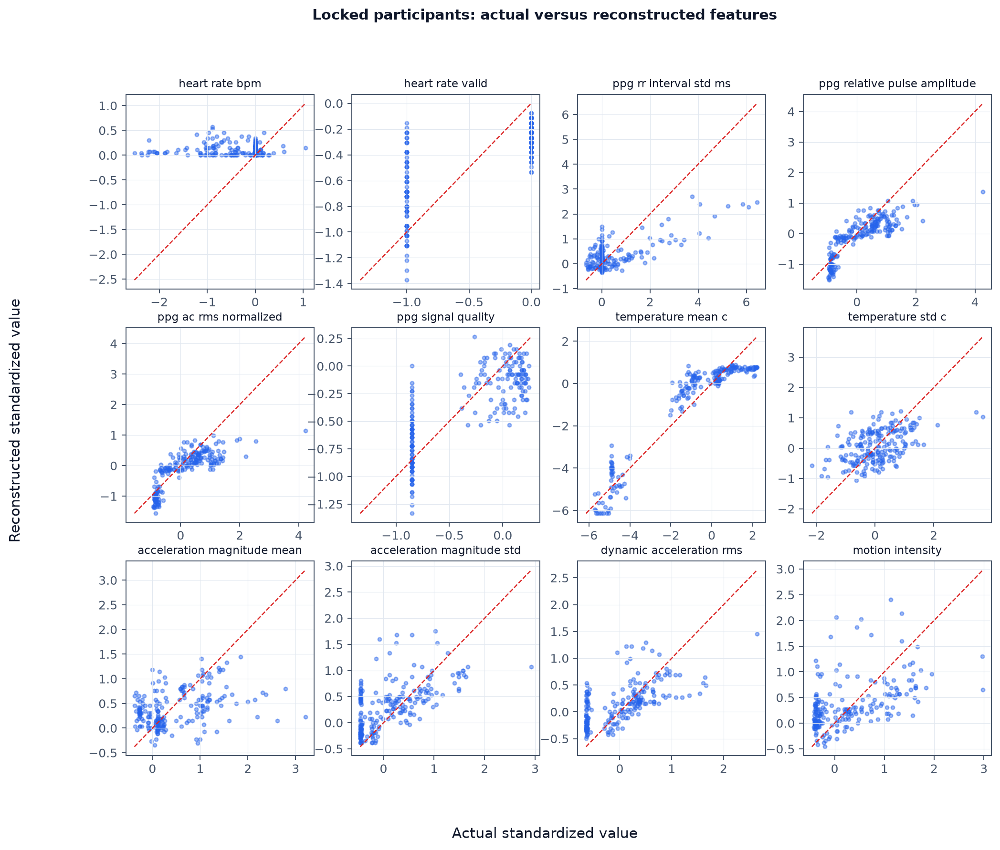
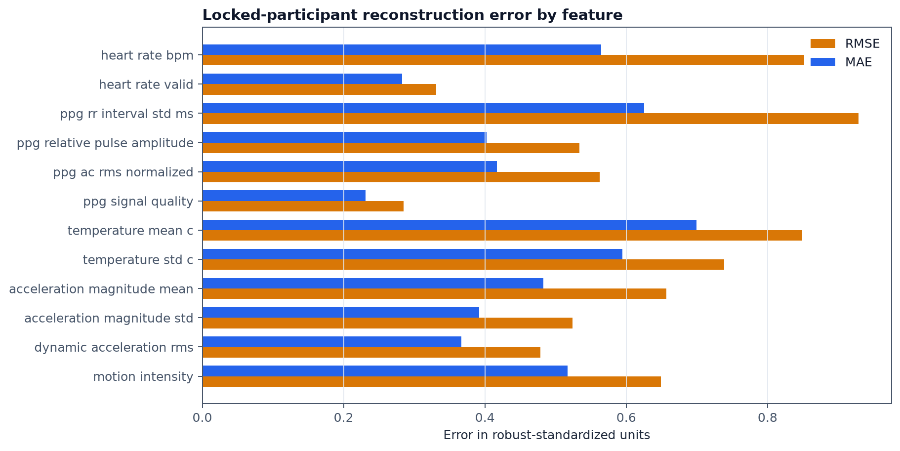
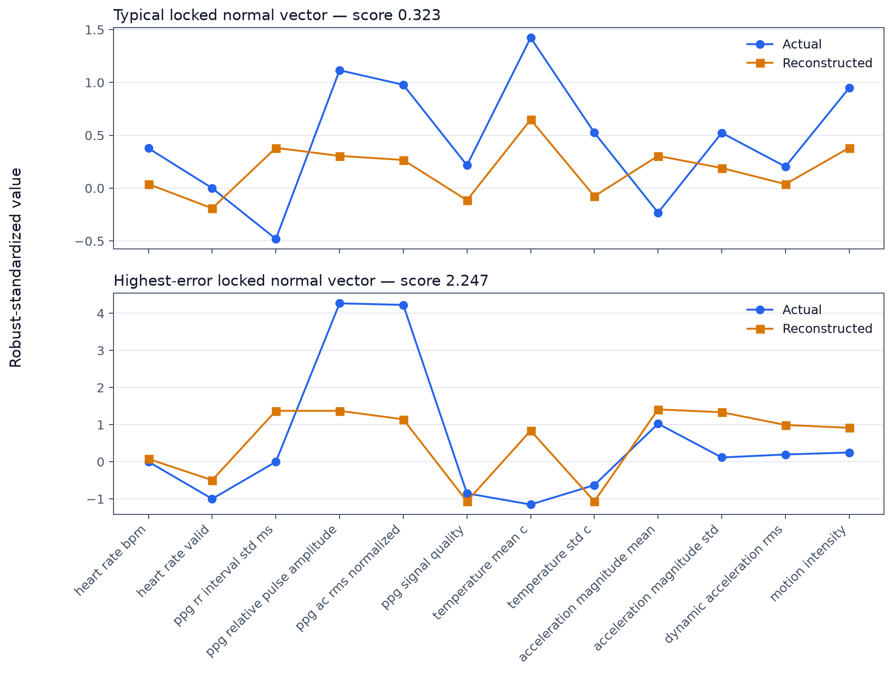
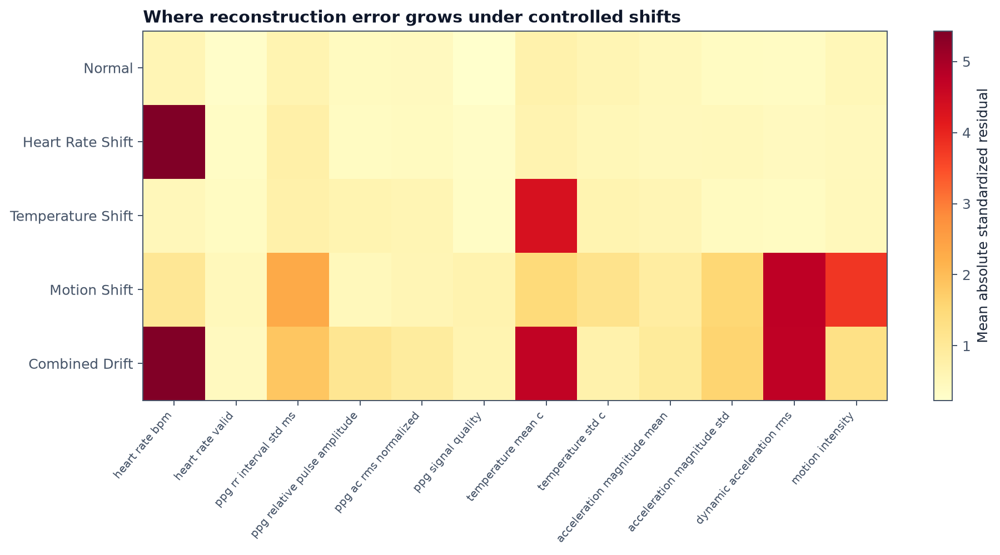

# Model V2: real-PPG development candidate

## What it is

V2 is a 4.2 KiB integer autoencoder trained only on normal recordings from 22
real people. It receives one short sensor-feature vector at a time. About 16
vectors arrive during eight minutes; the gateway combines their reconstruction
errors into one binary `normal` or `anomaly` result.

V2 is committed and runnable, but is not yet the Pi default. Its feature list is
based on the public dataset, not Victory's final 20-field BLE payload.

## What trained it

The source is Pulse Transit Time PPG version 1.1.0:

- 22 healthy participants and 66 sitting, walking, and running recordings;
- 5 seconds of waveform sampled every 30 seconds, matching the proposed
  wearable wake cycle;
- 1,112 extracted vectors;
- PPG, sensor temperature, and acceleration;
- ECG peak annotations used only to check PPG-derived heart rate.

SpO2 exists only at each recording's start and end. It is not interpolated and
does not enter this autoencoder. Continuous SpO2 must stay in the wearable and
personal-baseline tiers until target-wearable recordings are available.

## The 12 experimental inputs

The candidate vector contains derived heart rate plus validity, PPG timing,
amplitude and quality summaries, temperature mean/spread, and acceleration/motion
summaries. The exact order is in
[`dataset-feature-manifest.json`](../../models/real-ppg-v2/dataset-feature-manifest.json).

Heart rate is accepted when distal red, infrared, and green PPG estimates agree
within 5 BPM. Otherwise `heart_rate_valid=0`; heart rate is imputed to the normal
centre for the model, and the remaining features still produce a prediction.
Across accepted vectors, PPG heart rate was 1.81 BPM MAE from ECG. Coverage was
69.6% overall.

## Training and validation

Four participants (`s3`, `s9`, `s11`, `s14`) were locked before development.
The other 18 participants underwent five-fold grouped validation: one person
never appears in both training and validation within a fold. Every fold was
converted to int8 before its validation errors were collected.

For each eight-minute recording:

1. score every available short vector by mean squared reconstruction error;
2. use the 95th percentile as the interval score;
3. flag a persistent anomaly after two consecutive high intervals;
4. flag one interval immediately if it exceeds the severe threshold.

The persistent threshold is the 95th percentile of 54 quantized out-of-fold
healthy interval scores. The untouched test contains 12 intervals from four
people.

| Check | Result |
|---|---:|
| Healthy cross-validation intervals flagged | 3 / 54 (5.56%) |
| Healthy locked intervals flagged | 0 / 12 (0%) |
| Controlled combined shifts detected | 12 / 12 |
| Controlled heart-rate shifts detected | 11 / 12 |
| Controlled motion shifts detected | 12 / 12 |
| Controlled temperature shifts detected | 6 / 12 |

Controlled shifts are six robust training scales and are not disease labels.
Temperature-only sensitivity is weaker, so the independent 48-hour personal
temperature baseline remains necessary.

## Direct reconstruction comparisons

The four locked participants contribute 204 vectors to these comparisons. They
were not used to fit the final model. Values are shown in robust-standardized
units because BPM, temperature, acceleration, and signal-quality values have
different physical scales.

Points near the red diagonal are reconstructed closely. The chart makes the
compression trade-off visible: pulse amplitude and several motion features
retain a clearer relationship, while extreme heart-rate, RR-variability and
temperature values are pulled toward the learned normal centre.

The feature chart reports both mean absolute error and root mean squared error.
The larger RMSE for heart rate, RR variability and mean temperature shows that
occasional larger misses dominate those features; this is also why the gateway
keeps independent personal vital-sign checks.

The first panel is the median-error locked normal vector. The second is the
highest-error locked normal vector. This shows why decisions use an eight-minute
aggregate and persistence rule rather than declaring every imperfect vector an
anomaly.

The heatmap connects each controlled change to the features where reconstruction
error grows. Heart-rate, temperature and motion changes concentrate in their
expected columns, while the combined drift raises all three families.

The machine-readable actual and reconstructed arrays are in
[`reconstruction-evaluation.json`](../../models/real-ppg-v2/reconstruction-evaluation.json).
All ten plots are in [`docs/assets/real-ppg-v2`](../assets/real-ppg-v2/).

## How it is used

The Pi loads `model.tflite` and `model-metadata.json` together. The runtime:

- verifies the SHA-256, input order, shape, dtype, and int8 scales;
- normalizes a feature vector using the committed training statistics;
- reconstructs it and records per-feature and overall errors;
- combines one eight-minute batch into a binary prediction;
- uses the public-data threshold until personal calibration is ready;
- after 48 elapsed hours and at least 288 valid eight-minute intervals, uses
  that person's mean reconstruction error plus three standard deviations.

The reusable runtime is
[`vector_autoencoder.py`](../../src/home_health_monitor/gateway/vector_autoencoder.py).
The executable training source is
[`train-real-ppg-vector-autoencoder.ipynb`](../../notebooks/train-real-ppg-vector-autoencoder.ipynb).

## What remains before promotion

1. Victory confirms the exact 20 fields, formulas, units, order, quality flags,
   and decoded BLE example.
2. The dataset extractor and gateway adapter are changed to that same manifest.
3. Continuous normal data from the actual wearable and target population is
   collected, including real SpO2.
4. The candidate is retrained and its memory/latency measured on the 512 MB Pi.

Until then V1 stays the service default and V2 stays an explicit development
candidate; the registry prevents the two artifacts from being confused.
