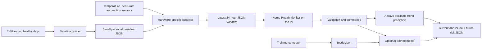

# Raspberry Pi deployment guide

This guide explains how the original Home Health Monitor idea fits together and
how to run the implemented service on a 512 MB or 1 GB Raspberry Pi.

## What runs where



The Raspberry Pi service implemented in this repository starts at the `API`
box. It accepts JSON, validates it, calculates features and returns predictions.

What this repository deploys:

- the lightweight standard-library JSON server, without FastAPI;
- input validation and 1-, 6- and 24-hour summaries;
- first-day and personal-baseline predictions;
- optional trained-model inference;
- the baseline builder and Linux service configuration.

What remains hardware- or product-specific:

- sensor drivers and the collector process;
- the screen, mobile application or upstream controller that displays results;
- an authenticated HTTPS gateway if requests must leave the Pi;
- the final trained and clinically evaluated illness model.

The hardware-specific collector is a separate integration component. It must:

1. read the actual sensors using their supported GPIO, I2C, serial or Bluetooth
   libraries;
2. convert readings to the API names and units;
3. retain or assemble the latest 24-hour window;
4. add the person's small baseline object when one exists;
5. send the request to `http://127.0.0.1:8080/v1/predict`;
6. deliver the returned JSON to the display, controller or upstream system.

That collector cannot be completed correctly until the exact sensor models and
communication protocols are known. It should run on the same Pi so the
prediction service can remain private on `127.0.0.1`.

## Prediction behavior on the Pi

The service always returns current and future classifications:

- On the first valid day, `within_day_trend` compares the later readings with
  the earlier readings. Confidence is low.
- After attaching a 7–30 day baseline, `personal_baseline_trend` compares the
  person with their own normal state. Confidence is moderate.
- After installing a trained `model.json`, `trained_logistic_model` replaces the
  provisional risk calculation with model probabilities.

The personal change assessment remains available even when a trained model is
installed.

## Recommended Pi setup

Use Raspberry Pi OS Lite Bookworm or newer without a desktop. Python 3.10 or
newer is required. The inference service has no third-party Python dependencies.

On the Pi:

```sh
sudo apt update
sudo apt install --no-install-recommends python3 ca-certificates git curl
```

Create a non-login service account:

```sh
sudo adduser --system \
  --group \
  --no-create-home \
  --home /opt/home-health-monitor \
  home-health
```

This creates both the `home-health` user and the matching group required by the
systemd unit. If the account already exists, verify both entries with
`id home-health`.

## Install the application

Clone the repository into its fixed service path:

```sh
sudo git clone https://github.com/Sammybams/home-health-monitor.git \
  /opt/home-health-monitor
sudo chown -R root:home-health /opt/home-health-monitor
sudo chmod -R o-rwx /opt/home-health-monitor
sudo chmod -R g+rX /opt/home-health-monitor
```

Install the service definition:

```sh
sudo install -o root -g root -m 0644 \
  /opt/home-health-monitor/deploy/home-health-monitor.service \
  /etc/systemd/system/home-health-monitor.service
sudo systemctl daemon-reload
sudo systemctl enable --now home-health-monitor
```

The service:

- runs as the unprivileged `home-health` account;
- starts automatically after boot;
- restarts after unexpected failure;
- binds only to `127.0.0.1:8080`;
- uses a 64 MB process memory ceiling;
- sees the operating-system filesystem as read-only;
- does not require NumPy, pandas, scikit-learn or FastAPI.

The 64 MB ceiling is a starting configuration. Confirm actual memory and latency
on the exact 512 MB Pi and OS image before field deployment.

Inspect live resource usage with:

```sh
systemctl show home-health-monitor \
  -p MemoryCurrent -p MemoryMax -p TasksCurrent
```

## Verify the installation

Check the Linux service:

```sh
sudo systemctl status home-health-monitor --no-pager
```

Check its API:

```sh
curl -sS http://127.0.0.1:8080/health
```

A working installation without a trained model returns HTTP 200 with:

```json
{
  "status": "ready",
  "change_assessment_available": true,
  "illness_model_loaded": false
}
```

Send the repository's first-day example:

```sh
sudo -u home-health curl -sS -X POST http://127.0.0.1:8080/v1/predict \
  -H 'Content-Type: application/json' \
  --data-binary @/opt/home-health-monitor/examples/request.json
```

The response contains both current and future provisional predictions even
though no baseline or trained model is installed.

The command uses the service account because the recommended permissions
intentionally prevent ordinary login users from reading application files under
`/opt/home-health-monitor`.

## Create and use a personal baseline

The collector should save 7–30 known healthy daily windows as JSON Lines. Keep
health data outside the application repository, for example:

```sh
sudo install -d -o home-health -g home-health -m 0700 \
  /var/lib/home-health-monitor
```

Build the profile:

```sh
sudo -u home-health env PYTHONPATH=/opt/home-health-monitor/src \
  /usr/bin/python3 -m home_health_monitor.baseline_cli \
  /var/lib/home-health-monitor/healthy-days.jsonl \
  /var/lib/home-health-monitor/baseline.json
```

The service is stateless: it does not search the filesystem for this profile.
The collector reads `baseline.json` and inserts the object into the `baseline`
field of each prediction request. This makes subject ownership explicit and
keeps the inference server simple.

## Install a trained model later

Training happens on a development computer, not on the Pi. Copy the exported
artifact to the Pi's temporary directory, then install it with controlled
ownership and permissions:

```sh
scp artifacts/model.json pi@PI_ADDRESS:/tmp/home-health-model.json
ssh pi@PI_ADDRESS sudo install -o root -g home-health -m 0640 \
  /tmp/home-health-model.json \
  /opt/home-health-monitor/artifacts/model.json
ssh pi@PI_ADDRESS sudo systemctl restart home-health-monitor
```

Replace `PI_ADDRESS` and the SSH username when needed. Call `/health` again and
confirm `illness_model_loaded` is `true` before relying on model output.

## Logs and troubleshooting

View recent logs:

```sh
sudo journalctl -u home-health-monitor -n 100 --no-pager
```

Follow live logs:

```sh
sudo journalctl -u home-health-monitor -f
```

Restart after changing the model or service configuration:

```sh
sudo systemctl restart home-health-monitor
```

Common checks:

- `connection refused`: confirm the service is active and listening on port
  8080;
- HTTP 422: inspect the input names, units, timestamps and subject/baseline IDs;
- `illness_model_loaded: false`: the service still predicts provisionally;
- systemd memory termination: inspect the logs and measure memory on the actual
  Pi before raising `MemoryMax` carefully.

Raw health request bodies are not written to service logs.

## Updates

Apply code updates explicitly and restart only after tests pass:

```sh
sudo git -C /opt/home-health-monitor pull --ff-only origin main
sudo -u home-health env PYTHONDONTWRITEBYTECODE=1 \
  PYTHONPATH=/opt/home-health-monitor/src \
  /usr/bin/python3 -m unittest discover \
  -s /opt/home-health-monitor/tests -v
sudo systemctl restart home-health-monitor
curl -sS http://127.0.0.1:8080/health
```

For controlled deployments, record the deployed Git commit with:

```sh
sudo git -C /opt/home-health-monitor rev-parse HEAD
```

After initial installation or an update, reboot once and confirm the service
starts without an SSH session:

```sh
sudo reboot
```

After reconnecting, call `/health` and send the example request again. Also test
with the internet disconnected; local sensor-to-prediction operation does not
require internet access.

## Network and privacy boundary

Do not change the service to `0.0.0.0` merely to make it reachable from another
computer. If remote access is required, place an authenticated HTTPS gateway in
front of it and define retention and access policies for the health data. The
default localhost-only deployment is the safest fit for the original Pi plan.

## Deployment responsibility summary

| Component | Status | Location |
| --- | --- | --- |
| JSON validation and feature extraction | Implemented | Pi prediction service |
| First-day current and future prediction | Implemented | Pi prediction service |
| Personal baseline builder and prediction | Implemented | Pi or preparation computer |
| Optional trained-model inference | Implemented; model artifact pending | Pi prediction service |
| Physical sensor drivers | Pending exact sensor models | Pi collector |
| Rolling 24-hour sensor buffer | Pending collector integration | Pi collector |
| Display, mobile application or remote gateway | Pending product choice | Pi or external device |
| Validated illness model | Pending labelled target-device data | Trained away from Pi |

This matches the initial plan: the lightweight AI and JSON service run on the
Pi, while the collector plugs in once the exact body-temperature,
ambient-temperature, heart-rate and motion hardware is known.
