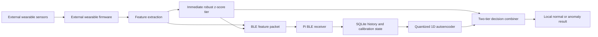

# Two-Tier Personal Anomaly Monitor Design

## Purpose

Build a battery-conscious wearable and Raspberry Pi home gateway that decide
whether the wearer's current physiological pattern is `normal` or `anomaly`
relative to that person's own baseline.

This repository implements only the Raspberry Pi home gateway. Wearable
firmware is an external producer described here only to define the BLE packet
contract consumed by the gateway.

The system does not diagnose a disease, predict a named illness or estimate a
medical probability. An `anomaly` means that the readings or their recent
pattern have departed enough from the person's baseline that somebody should
check the person or device.

SMS, cellular networking, recipient management, message formatting, delivery
retries and every other notification-delivery mechanism are outside this
repository. The gateway produces a local, structured alert event for another
system to consume.

## Fixed scope and terminology

The wearable has three sensing groups:

1. an optical PPG/SpO2 sensor, from which SpO2 and pulse/heart rate are derived;
2. a temperature sensor attached to the body;
3. an accelerometer, from which motion is derived.

Heart rate is therefore a derived measurement, not a fourth required sensor.
The temperature field must describe its actual measurement site and type. A
wrist skin temperature must never be presented as core body temperature.

The final decision has exactly two values:

- `normal`: no configured tier found a meaningful deviation;
- `anomaly`: an immediate deviation, a long-term reconstruction deviation, a
  persistent sensor failure or insufficient trustworthy data requires review.

The response may include reasons, scores, contributing signals, timestamps and
data-quality information, but these do not add a third decision class.

## Architecture



### External wearable node

The wearable behavior is outside this repository. It wakes on a configurable
schedule. The initial deployment default is one cycle per minute. During a cycle
it samples for 2-5 seconds, filters the signals, derives the compact features,
performs the immediate mathematical check, transmits one BLE packet and returns
to sleep.

The gateway assumes that the external wearable does not run the long-term
autoencoder. The external wearable contract requires it to:

- remove clearly invalid sensor samples;
- derive pulse rate from the optical waveform;
- calculate SpO2 using the selected sensor's reviewed algorithm;
- summarize contact temperature;
- summarize motion from acceleration after accounting for gravity;
- calculate signal-quality values;
- run the immediate personal-deviation rule;
- send a small versioned packet over BLE.

### Home gateway

The Raspberry Pi receives and validates BLE packets, rejects duplicates, records
gaps and stores accepted packets in SQLite. It maintains the calibration state
and a rolling history, constructs fixed 24-hour sequences, runs the long-term
model and combines the two tiers.

Training never runs on the Pi. The Pi loads an integer-quantized inference
artifact and its metadata. If the model cannot load, the gateway continues to
use the wearable decision plus its own robust personal-baseline fallback.

## BLE feature-packet contract

Each packet contains:

- schema version;
- private subject and device identifiers;
- monotonically increasing sequence number;
- UTC measurement timestamp;
- sampling duration;
- firmware and sensor configuration identifiers;
- derived heart rate in beats per minute;
- SpO2 percentage;
- contact temperature in degrees Celsius;
- temperature type and measurement site;
- motion intensity and binary motion state;
- optical, temperature and motion quality values;
- immediate per-signal robust deviations;
- immediate wearable decision and reason codes.

The fixed autoencoder vector will be selected from approximately 20 numeric
features produced by the wearable. The exact sensor-dependent formulae are
versioned in a feature manifest so training and inference cannot silently use
different calculations.

Packets with an unknown schema or feature-manifest version are rejected. A
repeated sequence number is ignored. A gap is stored as missing data; previous
measurements are not copied forward.

## Personal calibration

The first 48 clock hours are the initial calibration period. A calibration is
accepted only after it contains at least 80 percent of the expected packets and
at least eight hours of valid low-motion data. Otherwise, calibration extends
until both requirements are met.

Only high-quality readings are used. For each feature, the wearable or gateway
stores a median and a median absolute deviation with a small feature-specific
floor. This produces a robust z-score without allowing a single bad sample to
make the baseline unusable.

The initial baseline remains identifiable as a 48-hour baseline. The gateway
may build a more stable 7-day baseline after deployment, but it must not learn
from periods already flagged as anomalous. Baseline updates are atomic and
retain the previous version for recovery.

## Tier 1: immediate mathematical anomaly

Tier 1 compares the current feature packet with the personal robust baseline.
It runs on the wearable and is intentionally simple.

The engineering starting rule is:

- flag an anomaly when one feature exceeds its severe threshold once; or
- flag an anomaly when a non-severe deviation persists for two consecutive
  packets.

Thresholds remain model metadata rather than hidden constants. Physiological
alarm thresholds require clinical review; software input-validity ranges are
not medical thresholds.

During initial calibration, the wearable reports `normal` unless it detects a
sensor failure or an independently configured severe safety threshold. The
packet states that personal calibration is incomplete.

## Tier 2: long-term 1D autoencoder

The gateway aggregates accepted packets into five-minute time steps. A complete
24-hour model window therefore contains 288 ordered steps. Each step contains
the fixed normalized feature vector and missing-data indicators.

The 1D convolutional autoencoder is trained only on windows considered normal.
It learns to reconstruct the normal temporal pattern. At inference, the gateway
calculates:

- overall reconstruction error;
- reconstruction error per feature group;
- a personal error threshold calibrated from the wearer's accepted calibration
  data;
- whether the error is persistent across consecutive inference windows.

Reconstruction error is an anomaly score, not an illness probability. The
gateway runs inference every five minutes. The engineering starting rule
requires two consecutive above-threshold windows unless the error exceeds the
severe model threshold.

The model is trained off-device and exported as an integer-quantized TensorFlow
Lite artifact. The deployment target is an artifact smaller than 1 MB, peak
gateway resident memory below 96 MB and a complete inference in under two
seconds on the 512 MB Raspberry Pi Zero 2 W. These limits are release gates and
must be measured on the actual Pi image.

## Two-tier decision

The combiner uses an OR policy:

```text
anomaly = wearable_anomaly OR gateway_anomaly OR persistent_data_failure
```

Every result records which term caused the decision. Signal-quality failure is
kept distinct from physiological deviation in the reason codes even though the
required final binary decision is `anomaly`.

An example local result is:

```json
{
  "decision": "anomaly",
  "triggered_by": ["gateway_autoencoder"],
  "reason_codes": ["persistent_spo2_reconstruction_error"],
  "measurements": {
    "heart_rate_bpm": 92,
    "spo2_percent": 91.5,
    "temperature_c": 37.4,
    "motion": 0
  },
  "calibration": {"status": "ready", "hours": 48},
  "timestamp": "2026-09-07T20:00:00Z"
}
```

The service stores or returns this event locally. It does not send it.

## Dataset roles

### GalaxyPPG

GalaxyPPG is used for engineering validation only:

- optical pulse-rate derivation against reference heart rate;
- accelerometer-to-motion feature design;
- motion-artifact and signal-quality tests;
- skin/contact and ambient-temperature processing experiments;
- timestamp alignment, missing-stream and participant-held-out tests.

It cannot train the final three-sensor autoencoder because it does not contain
SpO2, full-day windows or illness outcomes. Its temperature is Galaxy Watch skin
temperature, not core body temperature. Its participants also do not represent
the target population sufficiently for deployment validation.

### Supplied Mendeley data

The supplied `healthmonitoringandfalldetection.csv` is excluded because its 612
rows contain only 36 unique rows repeated 17 times. The corrected Version 2 file
may be used only for schema, pipeline and demonstration tests because it is
synthetic. Results from it must be labelled synthetic and must not be reported
as clinical or field performance.

### BIDMC

BIDMC may be used to test optical pulse processing or respiration research. It
is not used to train this autoencoder because its eight-minute ICU recordings
lack the required temperature and motion streams and do not match the intended
home population.

### Target-device normal data

The production autoencoder is trained from normal data collected using the
actual wearable hardware. Participants are split by person before creating
windows. Demographic balance, sensor placement and important health groups are
reported explicitly. Per-person robust normalization reduces population
differences but does not replace representative data or subgroup evaluation.

## Training and evaluation contract

Training runs on a development computer and performs these stages:

1. validate dataset provenance, sensor versions, feature versions and consent;
2. reject duplicates, invalid timestamps, low-quality samples and incomplete
   participant metadata;
3. create one-minute packets and five-minute aggregates without copying values
   into gaps;
4. fit personal normalizers using only each participant's training period;
5. create 288-step normal windows;
6. split participants into training, validation and untouched test groups;
7. train the small 1D convolutional autoencoder on normal training windows;
8. select global and persistence thresholds on validation participants;
9. quantify false anomalies on untouched normal participants and during known
   activities;
10. use simulated perturbations only as engineering sensitivity tests, never as
    evidence of disease detection;
11. quantize the selected model using representative target-device windows;
12. export the model, feature manifest, normalization contract, thresholds,
    dataset summary, metrics and cryptographic checksums.

Accuracy is not an appropriate primary metric because there are no disease
classes. The report includes normal-window false-alert rate, alerts per person
per day, reconstruction-error distributions, activity-specific false alerts,
missing-data behavior, subgroup results, model size, memory and latency.

## Gateway interfaces

The gateway exposes local-only interfaces:

- health/readiness status;
- BLE packet ingestion through an adapter boundary;
- current binary decision;
- recent local anomaly events;
- calibration status;
- model identity and feature-manifest identity.

The HTTP service remains bound to `127.0.0.1` by default. Raw health packets are
not written to application logs. SQLite health data uses restrictive filesystem
permissions and a documented retention policy.

The first repository implementation includes a simulated BLE adapter and the
versioned packet contract. Hardware BLE integration follows the same adapter
after the microcontroller, GATT service UUID, characteristic UUID and sensor
models are supplied.

## Failure behavior

- Invalid or unknown packets are rejected and recorded as counters without
  logging raw health values.
- Duplicate packets are ignored idempotently.
- Missing packets remain missing and contribute to data-quality indicators.
- A persistent loss of trustworthy data produces `anomaly` with a sensor or
  connectivity reason.
- A corrupt or incompatible model does not stop the service; the robust
  baseline tier remains available.
- An interrupted calibration resumes from durable state.
- A reboot does not erase calibration, sequence tracking or unexpired local
  anomaly events.

## Implementation increments

1. Correct the domain model, terminology and versioned packet contract.
2. Add reproducible audits and converters for GalaxyPPG and the corrected
   synthetic demonstration data.
3. Implement durable gateway packet storage and 48-hour calibration.
4. Implement the gateway robust-deviation fallback and consume the wearable's
   immediate decision without implementing wearable firmware.
5. Implement target-device window generation and normal-only autoencoder
   training.
6. Export and validate the quantized artifact and pure fallback metadata.
7. Implement Pi inference and the two-tier binary combiner.
8. Add the simulated BLE adapter, then the hardware adapter when identifiers
   and sensor models are available.
9. Measure memory, latency, restart recovery and offline operation on the
   Raspberry Pi Zero 2 W.
10. Rewrite the user, API, data, training and deployment documentation around
    the final anomaly-only scope.

Each increment is testable and committed separately. Dataset archives, health
records and generated participant windows remain outside Git.

## Acceptance criteria

- Every accepted inference produces exactly `normal` or `anomaly`.
- Heart rate is derived from the optical signal and is covered by quality
  checks.
- The gateway consumes the wearable-tier decision without containing wearable
  firmware.
- The gateway retains a rolling history and survives reboot.
- The 48-hour calibration extends automatically when coverage is insufficient.
- The gateway model uses ordered windows and normal-only training data.
- Participant identity never crosses training and test splits.
- Missing data is represented explicitly and is never silently forward-filled.
- GalaxyPPG and synthetic data are never described as illness-validation data.
- The service works without internet access and within measured Pi limits.
- No SMS, cellular-network or notification-delivery code or dependency exists.
- Prediction responses stay compact and do not repeat explanatory disclaimer
  text.

## External inputs required for hardware completion

The software design does not depend on a particular vendor, but physical BLE
integration requires the selected microcontroller, PPG/SpO2 sensor,
temperature sensor and accelerometer models; their sampling rates and units;
the feature computation firmware; and the GATT service and characteristic
identifiers. Until those are supplied, the simulator exercises the complete
gateway contract without pretending to be the final hardware driver.
